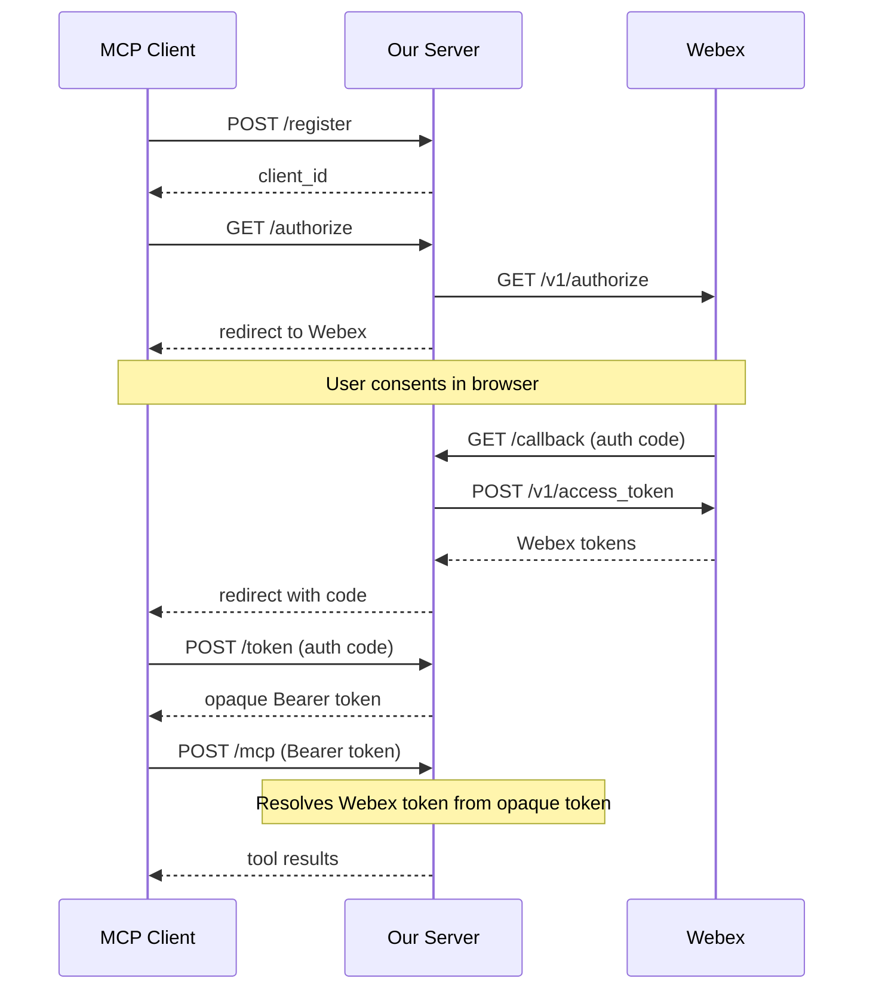

# Webex Go MCP Server

A Go-based [Model Context Protocol (MCP)](https://modelcontextprotocol.io/) server that exposes Cisco Webex APIs as tools. Supports both **STDIO** and **HTTP** transport modes. This allows LLMs (like Claude) to interact with Webex -- sending messages, managing rooms, scheduling meetings, downloading transcripts, and more.

## Features

- **Two transport modes**: STDIO (single-user, access token) and HTTP (multi-user, OAuth 2.1)
- **OAuth 2.1 Authorization Server**: In HTTP mode, acts as an MCP-compliant OAuth 2.1 authorization server, proxying Webex Integration OAuth (Authorization Code + PKCE)
- **Dynamic Client Registration**: RFC 7591 support for MCP clients to register dynamically
- **Opaque Bearer tokens**: Issues its own tokens to MCP clients; Webex tokens never exposed
- **Transparent token refresh**: Automatically refreshes expired Webex tokens
- **Multi-user support**: Each authenticated user gets their own Webex API context

**35 MCP tools** across 7 Webex API resource categories:

| Category | Tools | Operations |
|---|---|---|
| **Messages** | 5 | List, create, send attachment, get, delete messages |
| **Rooms** | 5 | List, create, get, update, delete rooms/spaces |
| **Teams** | 4 | List, create, get, update teams |
| **Memberships** | 4 | List, create, update, delete room memberships |
| **Meetings** | 6 | List, create, get, update, delete meetings; list participants |
| **Transcripts** | 5 | List transcripts, download content, list/get/update snippets |
| **Webhooks** | 5 | List, create, get, update, delete webhooks |

## Prerequisites

- Go 1.23 or later
- **STDIO mode**: A [Webex access token](https://developer.webex.com/docs/getting-your-personal-access-token)
- **HTTP mode**: A [Webex Integration](https://developer.webex.com/docs/integrations) (Client ID, Client Secret, Redirect URI)

## Build

```bash
go build -o webex-go-mcp .
```

## Configuration

Configuration is loaded via environment variables and/or CLI flags. CLI flags take precedence over environment variables.

### Common Options

| Env Variable | CLI Flag | Required | Default | Description |
|---|---|---|---|---|
| `WEBEX_MODE` | `--mode` | No | `stdio` | Server mode: `stdio` or `http` |
| `WEBEX_BASE_URL` | `--base-url` | No | `https://webexapis.com/v1` | Webex API base URL |
| `WEBEX_TIMEOUT` | `--timeout` | No | `30s` | HTTP request timeout |
| `WEBEX_INCLUDE_TOOLS` | `--include` | No | - | Comma-separated list of tools to include |
| `WEBEX_EXCLUDE_TOOLS` | `--exclude` | No | - | Comma-separated list of tools to exclude |
| `WEBEX_MINIMAL` | `--minimal` | No | `false` | Enable minimal tool set |
| `WEBEX_READONLY_MINIMAL` | `--readonly-minimal` | No | `false` | Enable readonly minimal tool set |

### STDIO Mode Options

| Env Variable | CLI Flag | Required | Default | Description |
|---|---|---|---|---|
| `WEBEX_ACCESS_TOKEN` | `--access-token` | Yes (stdio) | - | Webex API bearer token |

### HTTP Mode Options

| Env Variable | CLI Flag | Required | Default | Description |
|---|---|---|---|---|
| `WEBEX_CLIENT_ID` | `--client-id` | Yes (http) | - | Webex Integration Client ID |
| `WEBEX_CLIENT_SECRET` | `--client-secret` | Yes (http) | - | Webex Integration Client Secret |
| `WEBEX_REDIRECT_URI` | `--redirect-uri` | Yes (http) | - | OAuth redirect URI registered with Webex |
| `WEBEX_SERVER_URL` | `--server-url` | No | `http://host:port` | External base URL of this server |
| `WEBEX_OAUTH_SCOPES` | `--oauth-scopes` | No | `spark:all` | Webex OAuth scopes (space-separated) |
| `WEBEX_HOST` | `--host` | No | `localhost` | HTTP server bind host |
| `WEBEX_PORT` | `--port` | No | `8080` | HTTP server port |
| `WEBEX_TLS_CERT` | `--tls-cert` | No | - | Path to TLS certificate file |
| `WEBEX_TLS_KEY` | `--tls-key` | No | - | Path to TLS key file |

### Tool Filtering

You can control which tools are exposed using `--include` or `--exclude`. Tools are specified in `category:action` format, where `category` maps to the Webex API resource (e.g. `messages`, `rooms`, `meetings`) and `action` is the operation (e.g. `list`, `create`, `get`, `delete`).

Both singular and plural category forms are accepted (`message:list` and `messages:list` both work).

The `category:action` shorthand maps to the full tool name `webex_{category}_{action}`. For example, `messages:list` maps to `webex_messages_list`.

**Rules:**
- If `--include` is set, only the specified tools are registered.
- If `--exclude` is set, all tools except the specified ones are registered.
- If both are set, `--include` takes priority and `--exclude` is ignored.
- If neither is set, all 34 tools are registered (default).

**Available categories and actions:**

| Category | Actions |
|---|---|
| `messages` | `list`, `create`, `send_attachment`, `get`, `delete` |
| `rooms` | `list`, `create`, `get`, `update`, `delete` |
| `teams` | `list`, `create`, `get`, `update` |
| `memberships` | `list`, `create`, `update`, `delete` |
| `meetings` | `list`, `create`, `get`, `update`, `delete`, `list_participants` |
| `transcripts` | `list`, `download`, `list_snippets`, `get_snippet`, `update_snippet` |
| `webhooks` | `list`, `create`, `get`, `update`, `delete` |

#### Preset Flags

For convenience, two preset flags are available that automatically add a curated set of tools to the `--include` list:

- **`--minimal`** -- All operations for messages, rooms, teams, meetings, and transcripts (excludes memberships and webhooks). **24 tools.**
- **`--readonly-minimal`** -- Only read/list/get operations for messages, rooms, teams, meetings, and transcripts. No create, update, or delete. **12 tools.**

These flags **merge** with `--include` -- they don't override it. For example, `--minimal --include "webhooks:list"` registers the minimal set plus `webhooks:list`. If both `--minimal` and `--readonly-minimal` are set, `--minimal` takes priority.

**Examples:**

```bash
# Only register read-only transcript tools
./webex-go-mcp --include "transcripts:list,transcripts:download,transcripts:list_snippets,transcripts:get_snippet"

# Register all tools except destructive ones
./webex-go-mcp --exclude "messages:delete,rooms:delete,meetings:delete,memberships:delete,webhooks:delete"

# Use the minimal preset (messages, rooms, teams, meetings, transcripts)
./webex-go-mcp --minimal

# Use readonly-minimal (only read operations, no writes)
./webex-go-mcp --readonly-minimal

# Minimal preset plus an extra tool
./webex-go-mcp --minimal --include "webhooks:list"
```

## Usage

### STDIO Mode (default)

```bash
export WEBEX_ACCESS_TOKEN="your-token-here"
./webex-go-mcp
```

### HTTP Mode

```bash
export WEBEX_CLIENT_ID="your-client-id"
export WEBEX_CLIENT_SECRET="your-client-secret"
export WEBEX_REDIRECT_URI="http://localhost:8080/callback"
./webex-go-mcp --mode http --port 8080
```

#### Setting Up a Webex Integration (HTTP Mode)

1. Go to [developer.webex.com](https://developer.webex.com) and sign in
2. Navigate to **My Webex Apps** > **Create a New App** > **Integration**
3. Fill in the required fields:
   - **Redirect URI**: Set to `http://localhost:8080/callback` (or your server's `/callback` URL)
   - **Scopes**: Select the scopes your tools need (e.g., `spark:all`)
4. Note the **Client ID** and **Client Secret**
5. Set them as environment variables or CLI flags

#### HTTP Mode Endpoints

| Endpoint | Method | Auth | Description |
|---|---|---|---|
| `/.well-known/oauth-protected-resource` | GET | No | RFC 9728 Protected Resource Metadata |
| `/.well-known/oauth-authorization-server` | GET | No | RFC 8414 Authorization Server Metadata |
| `/register` | POST | No | RFC 7591 Dynamic Client Registration |
| `/authorize` | GET | No | OAuth authorization (redirects to Webex) |
| `/callback` | GET | No | OAuth callback (from Webex) |
| `/token` | POST | No | Token exchange (auth code → Bearer token) |
| `/mcp` | POST | Bearer | MCP Streamable HTTP endpoint |

#### OAuth Flow (HTTP Mode)



### Run directly from Git (no build required)

If you have Go installed, you can run the server directly from the repository without cloning or building. Go will fetch, compile, and execute in one step:

```bash
export WEBEX_ACCESS_TOKEN="your-token-here"
go run github.com/tejzpr/webex-go-mcp@latest
```

This is especially convenient when configuring MCP clients like Cursor or Claude Desktop -- no pre-built binary needed.

### Claude Desktop

Add to your Claude Desktop MCP configuration (`~/Library/Application Support/Claude/claude_desktop_config.json` on macOS):

**Using a pre-built binary:**

```json
{
  "mcpServers": {
    "webex": {
      "command": "/path/to/webex-go-mcp",
      "env": {
        "WEBEX_ACCESS_TOKEN": "your-token-here"
      }
    }
  }
}
```

**Using `go run` directly from Git (no build step):**

```json
{
  "mcpServers": {
    "webex": {
      "command": "go",
      "args": ["run", "github.com/tejzpr/webex-go-mcp@latest"],
      "env": {
        "WEBEX_ACCESS_TOKEN": "your-token-here"
      }
    }
  }
}
```

### Cursor

Add to your Cursor MCP configuration (`.cursor/mcp.json` in your project or `~/.cursor/mcp.json` globally):

**Using a pre-built binary:**

```json
{
  "mcpServers": {
    "webex": {
      "command": "/path/to/webex-go-mcp",
      "env": {
        "WEBEX_ACCESS_TOKEN": "your-token-here"
      }
    }
  }
}
```

**Using `go run` directly from Git (no build step):**

```json
{
  "mcpServers": {
    "webex": {
      "command": "go",
      "args": ["run", "github.com/tejzpr/webex-go-mcp@latest"],
      "env": {
        "WEBEX_ACCESS_TOKEN": "<WEBEX_ACCESS_TOKEN>"
      }
    }
  }
}
```

**With tool filtering (only expose specific tools):**

```json
{
  "mcpServers": {
    "webex": {
      "command": "go",
      "args": ["run", "github.com/tejzpr/webex-go-mcp@latest", "--include", "messages:list,messages:get,transcripts:list,transcripts:download"],
      "env": {
        "WEBEX_ACCESS_TOKEN": "<WEBEX_ACCESS_TOKEN>"
      }
    }
  }
}
```

**With readonly-minimal preset (safe, read-only access):**

```json
{
  "mcpServers": {
    "webex": {
      "command": "go",
      "args": ["run", "github.com/tejzpr/webex-go-mcp@latest", "--readonly-minimal"],
      "env": {
        "WEBEX_ACCESS_TOKEN": "<WEBEX_ACCESS_TOKEN>"
      }
    }
  }
}
```

> **Note:** The `go run` approach requires Go to be installed and available on your `PATH`. The first run will download and compile the module (cached for subsequent runs). To update to the latest version, Go will re-fetch when `@latest` resolves to a newer release.

## Tool Reference

### Messages

- **`webex_messages_list`** -- List messages in a room (requires `roomId`). Enriched with room context, sender names, and file metadata.
- **`webex_messages_create`** -- Send a text message. To DM someone, just pass `toPersonEmail` -- no room lookup needed. For group spaces, use `roomId`.
- **`webex_messages_send_attachment`** -- Send a message with a file attachment (public URL). Same destination options as create.
- **`webex_messages_get`** -- Get a message by ID. Enriched with sender profile, room info, and file content (text files inline).
- **`webex_messages_delete`** -- Delete a message by ID

### Rooms / Spaces

- **`webex_rooms_list`** -- List rooms (filter by `teamId`, `type`, `sortBy`)
- **`webex_rooms_create`** -- Create a room (`title` required, optional `teamId`)
- **`webex_rooms_get`** -- Get room details by ID
- **`webex_rooms_update`** -- Update room title
- **`webex_rooms_delete`** -- Delete a room

### Teams

- **`webex_teams_list`** -- List teams
- **`webex_teams_create`** -- Create a team (`name` required)
- **`webex_teams_get`** -- Get team details by ID
- **`webex_teams_update`** -- Update team name

### Memberships

- **`webex_memberships_list`** -- List memberships (filter by `roomId`, `personEmail`)
- **`webex_memberships_create`** -- Add person to room (`roomId` + `personEmail` or `personId`)
- **`webex_memberships_update`** -- Update membership (set `isModerator`)
- **`webex_memberships_delete`** -- Remove person from room

### Meetings

- **`webex_meetings_list`** -- List meetings (filter by `meetingType`, `state`, `from`, `to`). Note: `meetingType` is required when `state` is used.
- **`webex_meetings_create`** -- Schedule a meeting with optional invitees (`title`, `start`, `end` required; `invitees` accepts comma-separated emails)
- **`webex_meetings_get`** -- Get meeting details by ID
- **`webex_meetings_update`** -- Update a meeting
- **`webex_meetings_delete`** -- Cancel/delete a meeting
- **`webex_meetings_list_participants`** -- List who actually attended a past meeting (join/leave times, host status, devices)

### Transcripts

- **`webex_transcripts_list`** -- List meeting transcripts (filter by `meetingId`, `hostEmail`, date range)
- **`webex_transcripts_download`** -- Download transcript content (requires `transcriptId` + `meetingId`, optional `format`: `txt` or `vtt`)
- **`webex_transcripts_list_snippets`** -- List spoken segments from a transcript
- **`webex_transcripts_get_snippet`** -- Get a specific transcript snippet
- **`webex_transcripts_update_snippet`** -- Update/correct a transcript snippet's text

### Webhooks

- **`webex_webhooks_list`** -- List webhooks
- **`webex_webhooks_create`** -- Create a webhook (`name`, `targetUrl`, `resource`, `event` required)
- **`webex_webhooks_get`** -- Get webhook details by ID
- **`webex_webhooks_update`** -- Update a webhook
- **`webex_webhooks_delete`** -- Delete a webhook

## Architecture

```
webex-go-mcp/
  main.go       -- Cobra CLI + Viper config, mode branching (STDIO/HTTP)
  server.go     -- MCP server setup, STDIO + HTTP server startup
  auth/
    client_resolver.go  -- ClientResolver type (static for STDIO, context-based for HTTP)
    discovery.go        -- RFC 9728 + RFC 8414 well-known metadata endpoints
    middleware.go       -- Bearer token auth middleware, transparent token refresh
    oauth.go            -- /authorize, /callback, /token (proxies Webex OAuth)
    registration.go     -- RFC 7591 Dynamic Client Registration
    store.go            -- In-memory token store, auth code store, pending auth state
  tools/
    filter.go         -- ToolRegistrar interface, tool include/exclude filtering
    enrich.go         -- Response enrichment helpers (person names, room info, files)
    messages.go       -- 5 message tools
    rooms.go          -- 5 room tools
    teams.go          -- 4 team tools
    memberships.go    -- 4 membership tools
    meetings.go       -- 6 meeting tools
    transcripts.go    -- 5 transcript tools
    webhooks.go       -- 5 webhook tools
```

## Dependencies

- [mcp-go](https://github.com/mark3labs/mcp-go) -- MCP server framework (STDIO + Streamable HTTP)
- [webex-go-sdk](https://github.com/tejzpr/webex-go-sdk) -- Webex API client
- [cobra](https://github.com/spf13/cobra) -- CLI framework
- [viper](https://github.com/spf13/viper) -- Configuration management

## License

MPL-2.0
